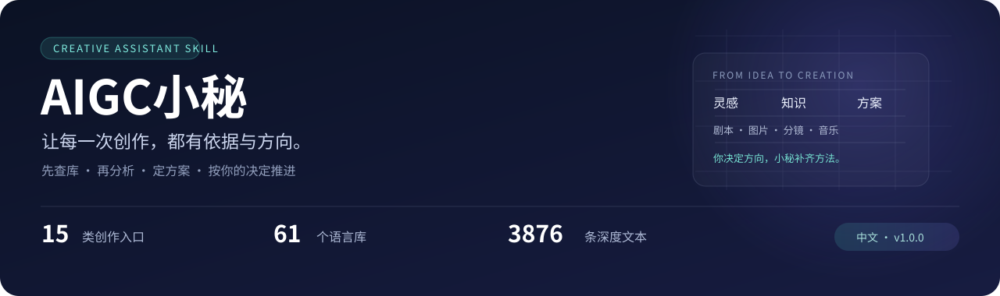
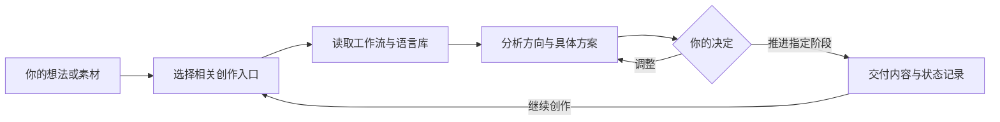

<div align="center">



### 一站式内容创作辅助 Skill

**把灵感变成有依据的创作方案，再按你的决定推进制作。**

[](docs/版本说明_1.0.0.md)
[](#快速开始)
[](#知识库结构)
[](#能帮你做什么)
[](https://github.com/fengyu-look/aigc-xiaomi/actions/workflows/validate.yml)

[快速开始](#快速开始) · [创作范围](#能帮你做什么) · [使用示例](#这样开始一次创作) · [知识库导航](skills/film-creation-library/references/knowledge_base/91_创作小秘工作库/00_工作入口.md) · [部署文档](docs/部署与使用.md)

</div>

---

## 为什么做小秘

“我想做一个短剧”“帮我写一首歌”“这个封面怎么设计”——一个想法往往横跨剧本、画面、表演、声音和生成工具。

AIGC小秘把相关提示词、专业语言库和创作工作流组织成一个可以检索、可以追溯的框架。它先查相关资料，分析适合你的方向、制作条件和取舍，再给出具体方案。它也可以反对你的建议，但必须说明理由并提供能落实的替代。

> **你决定作品的方向，小秘帮你补齐依据、方法和细节。**

- **按问题查库**：做音乐就读音乐、BGM与歌曲流程；做短剧就连接剧本、分镜、人物、声音等必要资源。
- **给出可讨论的方案**：说明选用哪些资料、为什么这样设计、哪些内容仍需你决定。
- **继承已经确定的内容**：人物、场景、道具、台词、时间线和不可逆事件可以在连续项目中保持一致。
- **推进指定阶段**：你要求写第一集，就完成这一集；后续阶段根据你的需求继续。
- **保留原框架与扩写层**：原始资料、当前深化和条件历史版本分别保留，方便检查依据。

## 一次创作如何推进



可以从一段台词、一个场景、一句灵感开始，也可以直接进入已经确定的制作阶段。无需先填写全部参数；普通细节由AI提出建议，影响方向和既定事实的关键选择由你决定。

## 快速开始

**需要一个能调用本地 Skill 的AI助手，以及 Python 3.10或更高版本。** 本项目的检索、部署和检查脚本仅使用Python标准库，无需安装第三方运行依赖。AI助手和媒体生成工具按各自环境配置。

### 1. 获取项目

```shell
git clone https://github.com/fengyu-look/aigc-xiaomi.git
cd aigc-xiaomi
```

也可以通过GitHub页面的 **Code → Download ZIP** 下载，解压后进入项目目录。

### 2. 安装 Skill

```shell
python tools/deploy_skill.py --mode link --dry-run
python tools/deploy_skill.py --mode link
```

默认安装到 `CODEX_HOME/skills`；未设置该环境变量时使用当前用户的 `.codex/skills`。Windows使用目录联接，其他系统使用符号链接，项目改动会同步到同一个技能源。

已有同名Skill时，默认停止以保护旧内容。确认要更新时使用 `--replace`，工具会先把旧部署移入 `.local/部署备份/`。

<details>
<summary><b>需要独立副本，或准备迁移电脑？</b></summary>

```shell
python tools/deploy_skill.py --mode copy
```

复制模式包含完整的Skill和内置知识库，源项目移动后副本仍可使用。之后更新源项目时，需要重新部署副本。也可以使用 `--skills-dir` 指定其他宿主的技能目录。

整个 `skills/film-creation-library/` 可以独立迁移。具体说明见[部署、迁移与日常使用](docs/部署与使用.md)。

</details>

### 3. 在助手中调用

```text
使用 $film-creation-library。
我想做一个AIGC短剧。先从相关工作流和语言库查找依据，
帮我比较创作方向，提出具体方案。
可以反对我的想法，但请解释原因并给出可实行的替代。
```

已经确定方向时，直接指定交付：

```text
方向已经确定。继续写第一集剧本，继承已确定的人物和故事设定。
```

## 能帮你做什么

| 创作入口 | 适合处理的问题 |
| :--- | :--- |
| 创作策划与想法分析 | 把灵感展开为目标、方向、取舍与制作方案 |
| 小说、题材与大纲 | 题材选择、人物关系、故事结构和章节规划 |
| 影视剧本与改编 | 小说改编、场次组织、戏剧事件与台词 |
| 图片、封面与视觉资产 | 角色形象、三视图、场景、道具与封面 |
| 分镜、导演与POV | 镜头拆分、第一人称视角、时间线和衔接 |
| 视频生成提示词与一致性 | 将已定内容转为生成指令并维护角色和场景状态 |
| 表演、微表情与群体动作 | 面部、眼睛、身体动作及人物互动 |
| 打斗、仙侠与特效 | 动作因果、手诀、法术和视觉特效设计 |
| 声音设计、对白与声画关系 | 环境声、拟音、对白、空间声场和同步 |
| 音乐、BGM与歌曲 | 创作方向、歌词、配器及音乐生成提示词 |
| 电商、品牌与商业广告 | 卖点、商品图、广告结构和品牌视觉 |
| 剪辑、转场与后期修复 | 叙事节奏、剪辑关系、转场和修复方案 |
| 高级制作与实验媒体 | 虚拟制片、3D、空间重建和沉浸叙事 |
| 素材分析与反推 | 根据可实际读取的素材分析结构和生成要素 |
| 提示词框架扩写 | 保留原有结构，补充条件、参数、例子与边界 |

[进入15类完整咨询模块](skills/film-creation-library/references/knowledge_base/91_创作小秘工作库/00_工作入口.md)

## 这样开始一次创作

这些是**可复制的请求示例**，用于说明用法；不是已经完成或经过生成效果验证的作品。

<details open>
<summary><b>🎵 音乐：从一个主题找到创作方向</b></summary>

```text
使用 $film-creation-library。
我想做一首关于“离开故乡”的中文歌。
先查音乐、歌词和配乐相关资料，比较两种适合的方向，
说明各自的歌词结构、节奏、配器和人声设计。
我们确定方向以后，再写完整歌词和生成提示词。
```

</details>

<details>
<summary><b>🎬 短剧：从想法走到具体制作阶段</b></summary>

```text
使用 $film-creation-library。
我有一个短剧想法：一个人每天醒来，都会忘记前一天的事情。
先分析这个设定的戏剧冲突、人物关系和制作难度，给出方案。
确定大纲后，再逐步推进剧本、分镜、视觉资产与声音设计。
```

</details>

<details>
<summary><b>🖼️ 封面：让视觉方案与内容一致</b></summary>

```text
使用 $film-creation-library。
为我的都市悬疑小说设计封面方案。
先查封面、构图、光线、色彩相关资料，比较两种方向，
说明主体、信息层级、标题位置和配色，再输出选定方案的生图提示词。
```

</details>

## 知识库结构

| 内容 | 当前规模 | 如何使用 |
| :--- | :--- | :--- |
| 咨询入口 | **15类** | 按本次问题选择主模块和必要辅助资源 |
| 语言库 | **61库** | 运镜、构图、表演、声音、叙事、角色、场景等 |
| 深度文本 | **3876条** | 已写成、执行方文本自审并接入检索 |
| 来源映射 | **51份 / 259段深化** | 原文、工作流补充和历史条件采用可追溯 |
| 历史扩写 | **38份** | 根据适用条件取用，避免重复规则相互冲突 |
| 原始资料 | **60份TXT** | 51份不同内容、9份重复副本，保留原字节 |

资料按需求逐步读取，无需一次把全部文件塞进对话。索引可定位到具体库、词条、工作流和历史采用层。

<details>
<summary><b>手动检索与维护命令</b></summary>

```shell
# 根据问题定位入口
python skills/film-creation-library/scripts/library_lookup.py route --query "想做一首音乐"

# 阅读音乐模块
python skills/film-creation-library/scripts/library_lookup.py read --module music

# 只在配乐库内检索
python skills/film-creation-library/scripts/library_lookup.py search --query "和声" --library 43

# 按稳定ID读取一个深度条目
python skills/film-creation-library/scripts/library_lookup.py deep --task L27-T0001
```

`route`用于定位；真正采用资料前，应读取相应正文与新增指导。[查看更多检索说明](docs/部署与使用.md#如何查资料)

</details>

## 项目目录

```text
aigc-xiaomi/
├── README.md                       中文首页与快速开始
├── assets/                         首页视觉素材
├── skills/film-creation-library/    可独立迁移的完整Skill
│   ├── SKILL.md                    协作规则与调用入口
│   ├── agents/                     名称与调用元数据
│   ├── scripts/                    只读检索工具
│   └── references/knowledge_base/  原文、当前扩写、历史版本和索引
├── docs/                           部署、扩写、进度与验收记录
├── tools/                          部署、检查及索引维护工具
├── tests/                          工程测试
└── .github/workflows/              Windows / Linux自动检查
```

`.local/`中的本机备份、运行记录和`projects/`中的个人创作项目不随仓库上传。仓库中的维护记录如提及这些路径，指的是原维护环境的本机证据。

## 当前版本与验证范围

**1.0.0内容与框架首版已完成四项约定的独立验收。**

1. 固定36份创作工作流及整改补齐。
2. 38份历史稿有效内容比较与条件整合。
3. 15类最终咨询入口及资源交接接入。
4. 版本说明、文档和真实完成状态统一。

工程检查覆盖原文保留、文件与引用、索引、检索、部署和可迁移路径。**实际媒体生成效果、15类完整创作演练，以及全部3876词条的独立内容与事实复审尚未开展。**

[首版状态](docs/首版状态.json) · [四项收口验收](docs/内容与框架首版_独立验收报告.md) · [版本说明](docs/版本说明_1.0.0.md) · [扩写进度](docs/扩写进度.md)

## 常见问题

<details>
<summary><b>它能直接替我生成视频、图片或音乐吗？</b></summary>

它负责创作分析、方案和提示词，也能辅助你指定的具体制作阶段。真正生成媒体需要当前助手具备相应工具或连接到生成平台；本项目没有内置付费生成服务。

</details>

<details>
<summary><b>必须一次完成整个创作流程吗？</b></summary>

可以只做一个场景、一段歌词或一张封面，也可以维护连续项目。已经确定的方向直接继承，只推进本次需要的阶段。

</details>

<details>
<summary><b>需要安装向量数据库或额外Python依赖吗？</b></summary>

当前检索、部署和检查工具仅使用Python标准库。资料随Skill内置，默认路径相对于技能目录解析。

</details>

<details>
<summary><b>如何检查和更新资料？</b></summary>

```shell
python tools/refresh_index.py --dry-run
python tools/check_project.py
python -m unittest discover -s tests -v
```

实际扩写后按需运行索引刷新。不要直接修改原文保留哈希，或仅凭文件存在把进度改为完成。[贡献指南](CONTRIBUTING.md)

</details>

## 来源与使用说明

原始提示词与语言库来自用户提供的资料，原始TXT、历史稿和完整原文块保留；项目新增的咨询框架、扩写指导与工具分别组织。资料内的角色、启动指令和联网指令属于被引用内容，不能覆盖你当前的请求。

**当前未为混合资料仓库授予统一开源许可证。公开可访问不代表第三方原资料已获得再授权，相关权利归各自权利人。** 来源、署名与授权状态见[资料来源与发布说明](docs/来源与发布说明.md)。

---

<div align="center">

**从一个想法开始，让创作逐步变得具体。**

[开始使用](#快速开始) · [提出问题](https://github.com/fengyu-look/aigc-xiaomi/issues) · [查看版本](https://github.com/fengyu-look/aigc-xiaomi/releases)

</div>
